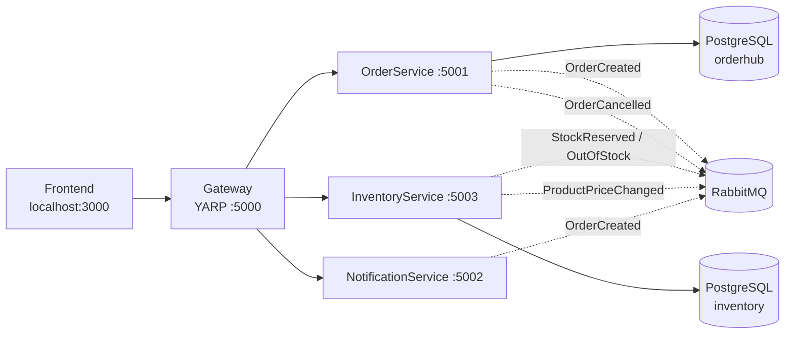

# OrderHub

Sistema de pedidos e estoque baseado em microsserviços. Demonstra comunicação síncrona via HTTP (API Gateway) e assíncrona via RabbitMQ com eventos de domínio.

## Stack

- **.NET 8** — API Gateway, OrderService, InventoryService
- **React 18 + Vite** — interface web, build otimizado e servido via nginx
- **PostgreSQL 16** — banco relacional por serviço
- **RabbitMQ 3** — message broker
- **MassTransit** — abstração sobre RabbitMQ
- **JWT Bearer** — autenticação no Gateway
- **Docker + Docker Compose** — execução local

## Arquitetura



### Fluxo de criação de pedido

1. Frontend chama `POST /api/orders` via Gateway.
2. OrderService cria o pedido com status `Pending` e salva o evento `OrderCreated` na tabela de outbox (mesma transação do pedido).
3. `OutboxProcessor` publica o evento para o RabbitMQ.
4. InventoryService consome `OrderCreated`, reserva estoque e publica `StockReserved` ou `OutOfStock`.
5. OrderService atualiza o pedido para `Confirmed` ou `Canceled`.
6. Ao cancelar um pedido confirmado ou pendente, OrderService publica `OrderCancelled` e InventoryService libera o estoque reservado.
7. NotificationService loga uma notificação ao receber `OrderCreated`.

## Como executar

### Requisitos

- Docker + Docker Compose
- .NET 8 SDK (para rodar testes e build local)
- Node.js 20 (para desenvolvimento do frontend)

### Passo a passo

1. Clone o repositório.
2. Copie as variáveis de ambiente de exemplo:

   ```bash
   cp .env.example .env
   ```

3. Suba a infraestrutura e os serviços:

   ```bash
   docker compose up --build
   ```

4. Acesse:
   - Frontend: http://localhost:3000
   - API Gateway: http://localhost:5000
   - Swagger OrderService: http://localhost:5000/swagger
   - RabbitMQ Management: http://localhost:15672 (guest/guest por padrão no `.env.example`)

### Autenticação

Os endpoints de escrita (`POST`, `PATCH`, `DELETE`) exigem JWT. Faça login pelo frontend ou diretamente:

```bash
curl -X POST http://localhost:5000/api/auth/login \
  -H "Content-Type: application/json" \
  -d '{"email": "usuario@exemplo.com"}'
```

Use o token retornado no header `Authorization: Bearer <token>`.

> Em produção, nunca use os valores padrão do `.env.example`. Utilize secrets do seu ambiente de deploy.

## Endpoints

Todos os endpoints são acessados via Gateway em `http://localhost:5000`.

### Autenticação

| Método | Rota | Descrição |
|--------|------|-----------|
| `POST` | `/api/auth/login` | Gera token JWT |

### Pedidos

| Método | Rota | Descrição | Auth |
|--------|------|-----------|------|
| `POST` | `/api/orders` | Cria um pedido | ✅ |
| `GET` | `/api/orders?skip=0&take=10` | Lista pedidos | ❌ |
| `GET` | `/api/orders/{id}` | Busca pedido por ID | ❌ |
| `PATCH` | `/api/orders/{id}/status` | Atualiza status do pedido | ✅ |

Exemplo de criação de pedido:

```json
{
  "customerName": "Maria Silva",
  "customerEmail": "maria@email.com",
  "items": [
    { "productName": "Notebook", "quantity": 1 },
    { "productName": "Mouse", "quantity": 2 }
  ]
}
```

### Estoque

| Método | Rota | Descrição | Auth |
|--------|------|-----------|------|
| `GET` | `/api/inventory/stock` | Lista produtos em estoque | ❌ |
| `POST` | `/api/inventory/stock` | Atualiza ou cria produto | ✅ |
| `DELETE` | `/api/inventory/stock/{productName}` | Remove produto | ✅ |

Exemplo de atualização de produto:

```json
{
  "productName": "Notebook",
  "quantity": 10,
  "unitPrice": 4999.99,
  "currency": "BRL"
}
```

## Estrutura do repositório

```
├── src/
│   ├── Gateway/                  # YARP reverse proxy
│   ├── InventoryService/         # Gestão de estoque e preços
│   ├── NotificationService/      # Consumidor de eventos (Node.js)
│   ├── OrderHub.Contracts/       # Contratos de mensagens
│   └── OrderService/             # Domínio, aplicação, infraestrutura e API
│       ├── OrderService.API/
│       ├── OrderService.Application/
│       ├── OrderService.Domain/
│       └── OrderService.Infrastructure/
├── tests/                        # Testes de unidade
├── frontend/                     # Aplicação React
├── docker-compose.yml
├── .env.example
└── OrderHub.sln
```

## Testes

```bash
# Build e testes de todos os projetos .NET
dotnet build OrderHub.sln
dotnet test OrderHub.sln
```

> Nota: em ambientes sem a SDK do .NET 8, use o `global.json` para garantir a versão correta.

## Decisões de design

- **CQRS manual no OrderService**: separação clara entre commands e queries sem adicionar bibliotecas pesadas.
- **Read model local de preços**: o OrderService replica preços recebidos via `ProductPriceChanged`, evitando chamadas síncronas ao InventoryService.
- **Event-driven para reserva de estoque**: desacopla criação de pedido da verificação de estoque, permitindo evoluir para saga pattern no futuro.
- **Outbox pattern**: eventos de domínio são persistidos na mesma transação do agregado e publicados assincronamente por um processador em background.
- **Liberação de estoque**: pedidos cancelados publicam `OrderCancelled`, que o InventoryService consome para devolver itens ao estoque.
- **Gateway com YARP**: centraliza acesso externo, rate limiting por IP, CORS configurável e autenticação JWT.
- **Swagger/OpenAPI**: documentação interativa dos serviços acessível via Gateway em desenvolvimento.

## Melhorias futuras

- Testes de integração com TestContainers
- Observabilidade com OpenTelemetry
- Dead-letter queue e retry policy explícita no MassTransit
- Concorrência otimista na reserva de estoque
